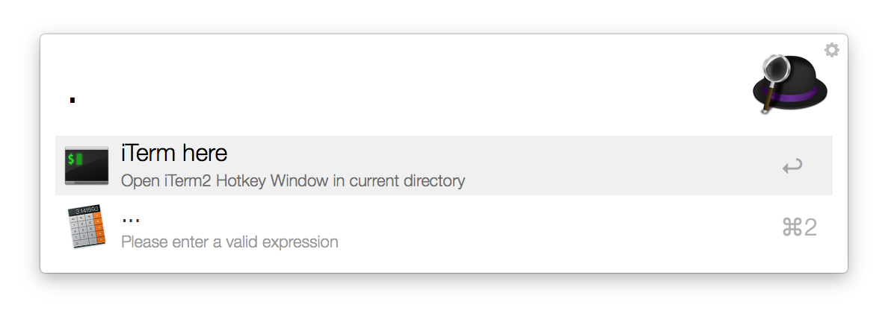
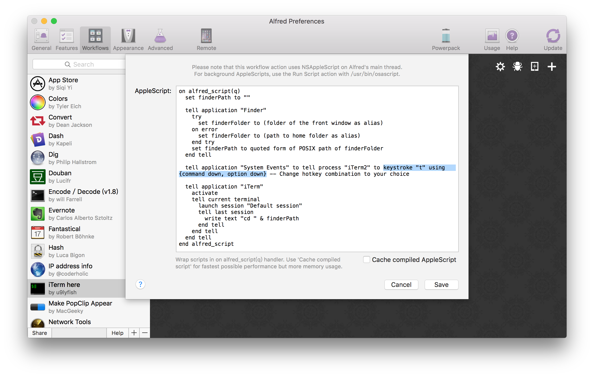

# alfred-iterm-here
A simple [Alfred 2](http://www.alfredapp.com/) workflow that opens a iTerm2 terminal in frontmost Finder window's directory in [iTerm2 Hotkey Window](https://www.iterm2.com/documentation-one-page.html#documentation-highlights.html). If no Finder window is open, the Terminal opens in the user's home directory.

    

## How to install

1. [Download the `.alfredworkflow` file from the Releases page](https://github.com/u9lyfish/alfred-iterm-here/releases) and open it with Alfred.
2. Modify hotkey combination to your choice.

    

